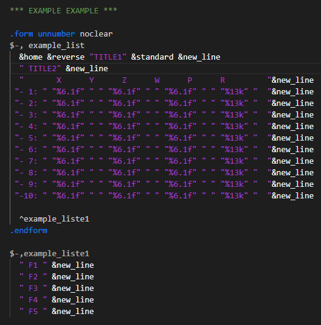
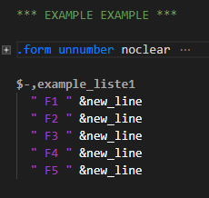

# fanuc-karel-syntax README

Makes life easier to read karel code in VSCode (#Fanuc #karel #.kl).

## Features

Just rudimentary/basic syntax highlighting for:
- (Fanuc) Karel code files (.kl).
- CM-files
- UTX, ETX and FTX files

## Screenshot

# Highlighters for FTX

# Foldings for FTX

## Requirements

None

## Installation

### Install from Marketplace

Just search for "Fanuc".

### Manual Installation

Just clone this repo into `~/.vscode/extensions` (on Linux/Mac)

On Windows the folder is `%USERPROFILE%\.vscode\extensions`

## Extension Settings

Include if your extension adds any VS Code settings through the `contributes.configuration` extension point.

Sorry There are NONE.

> For example:
>
> This extension contributes the following settings:
>
> - `myExtension.enable`: enable/disable this extension
> - `myExtension.thing`: set to `blah` to do something

## Known Issues

see [https://github.com/iBaff/vscode-fanuc-karel](https://github.com/iBaff/vscode-fanuc-karel)

## Release Notes

Users appreciate release notes as you update your extension.

### 0.0.3

- Update highlighter for CM, UTX, FTX and ETX files. 
- Foldings for FTX file
- Snippets for CM files
- new FANUC-theme

### 0.0.2

Added snippets, new KAREL theme and foldings

### 0.0.1

Initial release.

## Special thanks

to ONE Robotics Company for their GitHub repository: [https://github.com/onerobotics/vim-karel](https://github.com/onerobotics/vim-karel).

## Useful links for creating Syntax Highlighting for VSCode

https://github.com/onerobotics/vim-karel/blob/master/syntax/karel.vim  
http://www.onerobotics.com/posts/2013/introduction-to-karel-programming/

https://code.visualstudio.com/docs/extensions/yocode#_new-language-support  
https://code.visualstudio.com/docs/extensionAPI/language-support

https://stackoverflow.com/questions/28592093/converting-emacs-vim-highlighting-to-textmate-for-sublimetext

https://manual.macromates.com/en/language_grammars

https://raw.githubusercontent.com/martinring/tmlanguage/master/tmlanguage.json

https://github.com/kkos/oniguruma/blob/master/doc/RE  
https://docs.microsoft.com/en-us/dotnet/standard/base-types/regular-expression-language-quick-reference

https://github.com/Microsoft/vscode/blob/master/extensions/javascript/syntaxes/JavaScript.tmLanguage.json

> Now that we have our matches, we need our colors. The color associated with a match is specified by the name attribute. The color value of this name is defined by the current theme used by VS Code. Therefore, to consult all the available colors, you can open a default theme JSON file. It is located under the installation folder of VS Code (on windows, under AppData). For example, you can search for *dark_vs.json*, which is located under *app/extensions/defaults/themes/*. Therefore, it is not possible to create custom colors names for your language, unless you also create a custom theme for it.
>
>  \- http://gcthesoftwareengineer.com/2017/01/how-to-create-custom-syntax-highlighting-in-a-visual-studio-code-extension/
## Contributors

Thanks goes to these wonderful people ([emoji key](https://allcontributors.org/docs/en/emoji-key)):

<!-- ALL-CONTRIBUTORS-LIST:START - Do not remove or modify this section -->
<!-- prettier-ignore -->
<table><tr><td align="center"><a href="https://github.com/andymtorres"> <b>andymtorres</b></a> <a href="https://github.com/iBaff/vscode-fanuc-karel/commits?author=andymtorres" title="Code">💻</a></td><td align="center"><a href="https://github.com/WilliSeng"> <b>WilliSeng</b></a> <a href="https://github.com/iBaff/vscode-fanuc-karel/commits?author=WilliSeng" title="Code">💻</a></td></tr></table>

<!-- ALL-CONTRIBUTORS-LIST:END -->

This project follows the [all-contributors](https://github.com/all-contributors/all-contributors) specification. Contributions of any kind welcome!